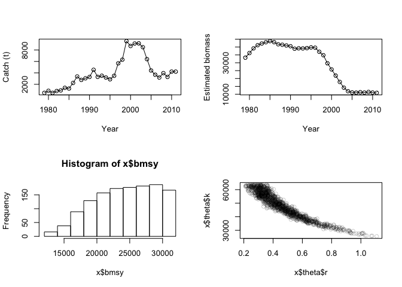
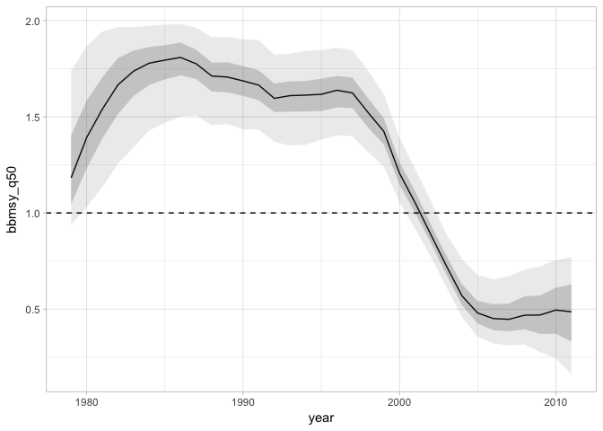

<!-- README.md is generated from README.Rmd. Please edit that file -->
Stock-assessment methods for data-limited fisheries
===================================================

[](https://magnum.travis-ci.com/datalimited/datalimited)

The R package datalimited can be installed from GitHub with:

``` r
# install.packages("devtools")
devtools::install_github("hadley/devtools") # temporarily needed due to a bug 
devtools::install_github("datalimited/datalimited")
```

Because the package includes C++ code, you will need a C++ compiler to install the package from source code. RStudio has a [good article](https://support.rstudio.com/hc/en-us/articles/200486498-Package-Development-Prerequisites) on setting this up.

The package implements the methods used in Rosenberg et al. (2014) including the following:

-   Catch-MSY based on Martell and Froese (2013); see `?cmsy`
-   Catch-only method with sample importance resampling based on asconcellos and Cochrane (2005); see `?comsir`
-   Panel regression in the style of Costello et al. (2012); see `?prm`
-   State-space catch-only model from Thorson et al. (2013); see `?sscom`

An example with `cmsy()`
------------------------

``` r
library("datalimited")
set.seed(1)
x <- cmsy(blue_gren$yr, ct = blue_gren$ct, reps = 2e4)
names(x)
#> [1] "theta"       "biomass"     "bmsy"        "msy"         "mean_ln_msy"
#> [6] "bbmsy"
par(mfrow = c(2, 2))
plot(blue_gren$yr, blue_gren$ct, type = "o", xlab = "Year", 
  ylab = "Catch (t)")
plot(blue_gren$yr,  apply(x$biomass, 2, median)[-1], type = "o",
  ylab = "Estimated biomass", xlab = "Year")
hist(x$bmsy)
plot(x$theta$r, x$theta$k, col = "#00000030")
```



``` r
library("ggplot2")
ggplot(x$bbmsy, aes(year, bbmsy_q50)) + geom_line()  +
    geom_ribbon(aes(ymin = bbmsy_q25, ymax = bbmsy_q75), alpha = 0.2) +
    geom_ribbon(aes(ymin = bbmsy_q2.5, ymax = bbmsy_q97.5), alpha = 0.1) +
    geom_hline(yintercept = 1, lty = 2) + theme_light()
```



References
----------

Costello, C., D. Ovando, R. Hilborn, S. D. Gaines, O. Deschenes, and S. E. Lester. 2012. Status and solutions for the world’s unassessed fisheries. Science 338:517-520.

Martell, S., and R. Froese. 2013. A simple method for estimating MSY from catch and resilience. Fish and Fisheries 14:504-514.

Thorson, J. T., C. Minto, C. V. Minte-Vera, K. M. Kleisner, and C. Longo. 2013. A new role for effort dynamics in the theory of harvested populations and data-poor stock assessment. Canadian Journal of Fisheries and Aquatic Sciences 70:1829–1844.

Vasconcellos, M., and K. Cochrane. 2005. Overview of World Status of Data-Limited Fisheries: Inferences from Landings Statistics. Pages 1-20 in G. H. Kruse, V. F. Gallucci, D. E. Hay, R. I. Perry, R. M. Peterman, T. C. Shirley, P. D. Spencer, B. Wilson, and D. Woodby, editors. Fisheries Assessment and Management in Data-Limited Situations. Alaska Sea Grant, University of Alaska Fairbanks.

Rosenberg, A. A., M. J. Fogarty, A. B. Cooper, M. Dickey-Collas, E. A. Fulton, N. L. Gutiérrez, K. J. W. Hyde, K. M. Kleisner, C. Longo, C. V. Minte-Vera, C. Minto, I. Mosqueira, G. C. Osio, D. Ovando, E. R. Selig, J. T. Thorson, and Y. Ye. 2014. Developing new approaches to global stock status assessment and fishery production potential of the seas. FAO Fisheries and Aquaculture Circular, Rome, Italy.
